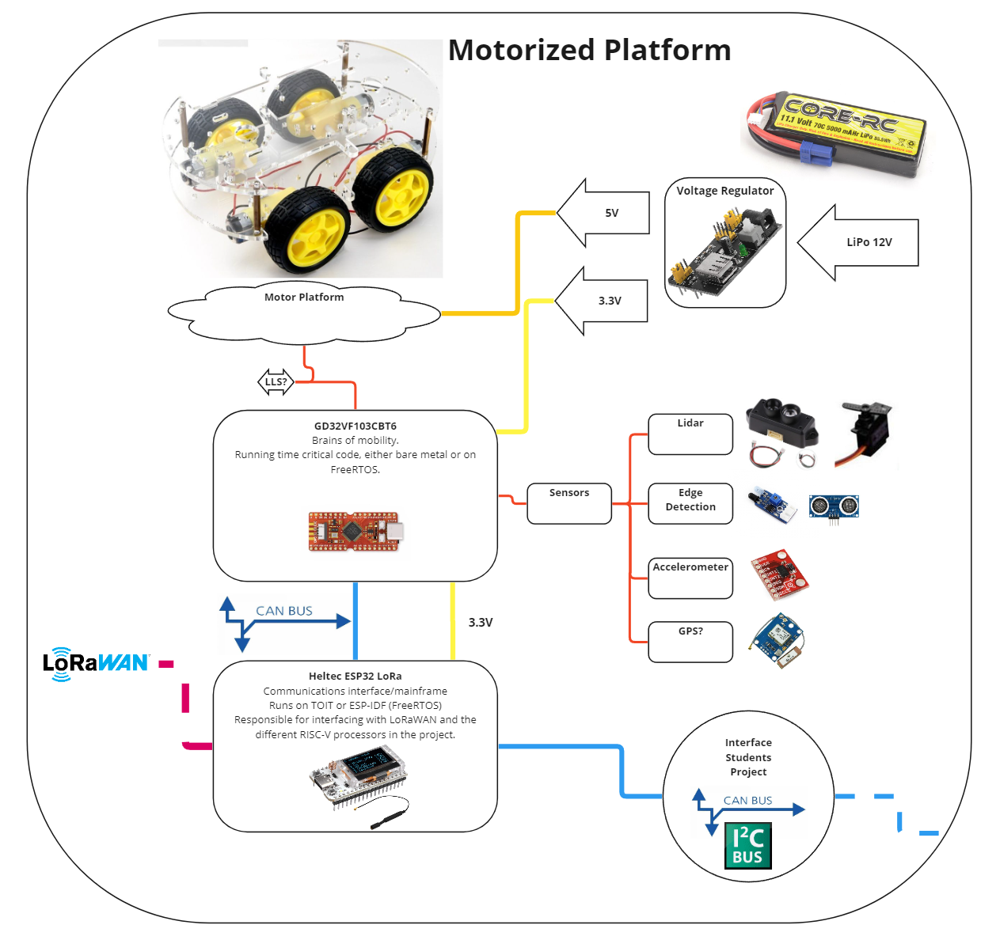
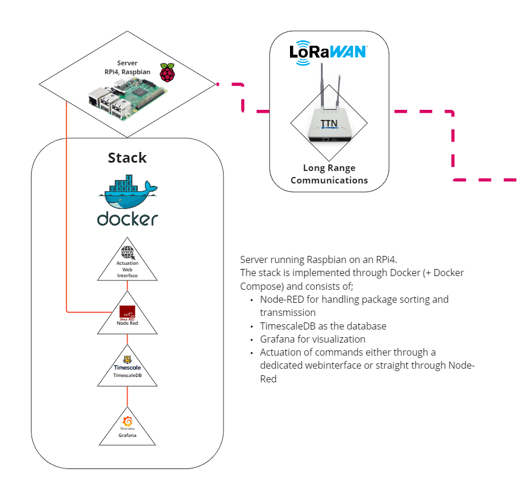
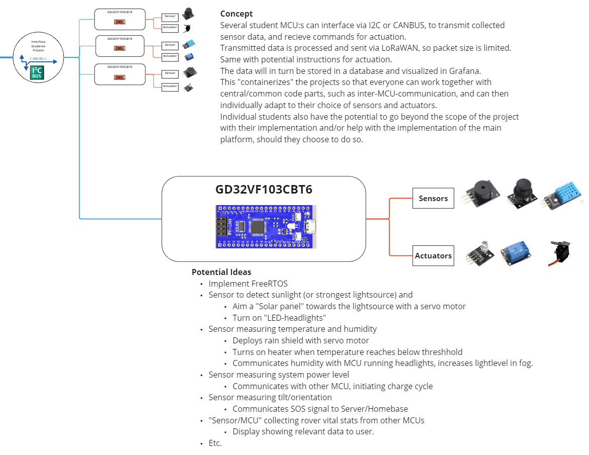
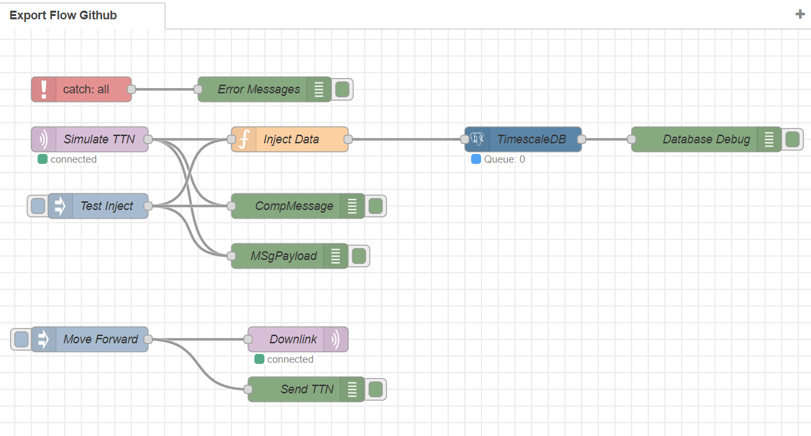
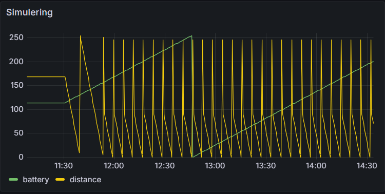
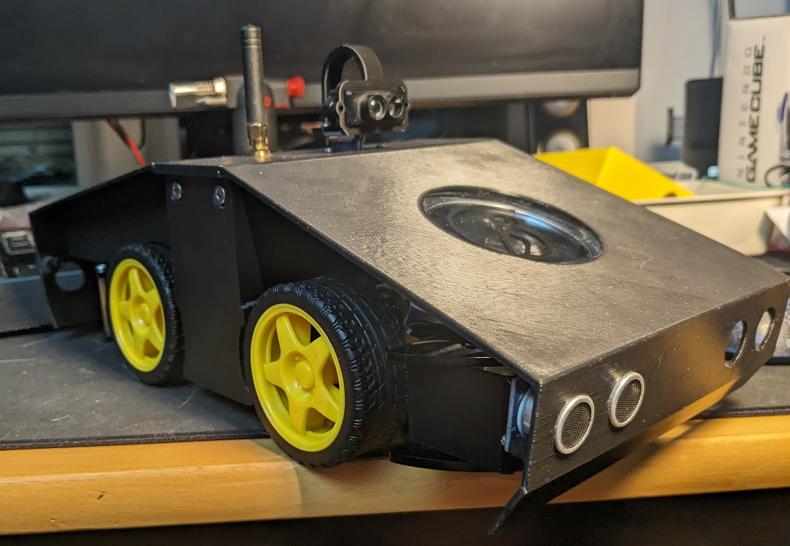

# LNU_RISCRUM-roVer
###### tags: `LNU` `KTH` `IoT` `LoRaWAN` `Rover` `TTN` `Sensors` `KTHCloud` `Ubuntu` `TimescaleDB` `Grafana` `NodeRED` `Heltec 32 LoRa v3` `Sipeed Longan Nano` `ESP32` `RISC-V` `FreeRTOS` `ESP-IDF` 

Author: Carl Johan Grevby

---

This project was set up as a means to learn more about embedded electronics and IoT.
To interface with the real world a rover was built on which several micro controllers perform different tasks.

The rover in this project is part of two courses at two different universities. 
At Linneaus University (LNU), the course [Applied Internet of Things, 4DV119](https://lnu.se/en/education/contract-education/utveckla-dig-sjalv/digitalisering-och-it/applied-internet-of-things/) 
and at the Royal Institute of Technology (KTH), the course [Microcomputer Engineering, Project Course, HE1041](https://www.kth.se/student/kurser/kurs/HE1041?l=en).

The LNU part of the rover is mainly the implementation of communication, from the Heltec 32 LoRa v3 MCU to the server and back again.
The KTH part of the rover is part of a group project, where the rover implementation is my responsibility. The rover in turn will interface with the other students MCUs that are responsible for gathering environmental data.

Estimated time to follow this tutorial: 20 - 40 hrs depending on resources and skill level

**Table of Contents**

1. [Objectives](#Objectives)
2. [Material](#Material)
3. [Environment setup](#Environment-setup)
4. [Putting everything together](#Putting-everything-together)
5. [Platforms and infrastructure](#Platforms-and-infrastructure)
6. [The code](#The-code)
7. [The physical network layer](#The-physical-network-layer)
8. [Visualisation and user interface](#Visualisation-and-user-interface)
9. [Finalizing the design](#Finalizing-the-design)
10. [References](#References)

<!---
Give a short and brief overview of what your project is about.
What needs to be included:

- [ ] Title
- [ ] Your name and student credentials (xx666xxx)
- [ ] Short project overview
- [ ] How much time it might take to do (an approximation)
-->

### Objectives

I chose to do this project to further my understanding with IoT, embedded electronics, LoRaWAN and autonomy. I saw an opportunity to combine two different projects/courses into one and decided to take it.
The separation between the different courses is somewhat blurred, but I consider that to be due to the fact that they are highly integrated.

The LNU side of the project serves the purpose of testing how to work around very limited communication and data rates, a simulated mars rover if you will. I also wanted to implement downlink commands over LoRaWAN.
The KTH side of the project serves the purpose of showcasing how different environmental sensors can be implemented in a hospital environment. I also wanted to implement basic autonomy for the rover using gathered data from the sensors. 
An inhospitable side and a hospitable side, if you will.

It's hard to speculate exactly what kinds of insights will be generated in this project, as it is very broad touching upon many different subjects, from communication, to kinematics, to databases etc.
What I do know is that I will learn. A lot. And I get to build a robot. I see that as an absolute win.  

<!--
Describe why you have chosen to build this specific device. What purpose does it serve? What do you want to do with the data, and what new insights do you think it will give?

- [ ] Why you chose the project
- [ ] What purpose does it serve
- [ ] What insights you think it will give
-->

### Material

For the bill of materials and their cost, please see the spreadsheet in the project folder,  [Bill of Materials](/Bill%20of%20Materials.xlsx). 

<!--
Explain all material that is needed. All sensors, where you bought them and their specifications. Please also provide pictures of what you have bought and what you are using.

- [ ] List of material
- [ ] What the different things (sensors, wires, controllers) do - short specifications
- [ ] Where you bought them and how much they cost
-->
   
### Environment setup

Praesent fringilla elit sit amet dui pretium, ut vestibulum turpis tempus. Donec vel maximus 
neque.

##### 1. IDE
VS Code running several different extensions.
 + ESP-IDF
 + PlatformIO

##### 2. MCU programming
MCUs are programmed in DFU mode over their respective USB-interfaces.
 + Heltec 32 LoRa v3 over the USB-C interface. Required Semtech drivers.
 + Sipeed Longan Nano over micro USB-B interface. Required WinUSB-drivers (using Zadig).

##### 3. Project Structure

 + TBD


##### 4. Prerequisites for 

 + TBD

<!--
How is the device programmed. Which IDE are you using. Describe all steps from flashing the firmware, installing plugins in your favorite editor. How flashing is done on MicroPython. The aim is that someone should be able to understand how to reproduce your project.

- [ ] Chosen IDE
- [ ] How the code is uploaded
- [ ] How is your project structured (important)
- [ ] Steps that you needed to do for your computer. Installation of Node.js, extra drivers, etc.
-->


### Putting everything together







<!--
How is all the electronics connected? Describe all the wiring, good if you can show a circuit diagram. Be specific on how to connect everything, and what to think of in terms of resistors, current and voltage. Is this only for a development setup or could it be used in production?

- [ ] Circuit diagram (can be hand drawn) (Fritzing, Tinkercad, etc.)
- [ ] Electrical calculations
- [ ] Limitations of hardware depending on design choices.
- [ ] Discussion about a way forward - is it possible to scale?
-->

#### Steps

##### 1. Print Chassi parts.
##### 2. Attach motors, MCUs, PSUs, Battery, sensors etc.
##### 3.  Solder up relevant connections.
##### 4. Upload code.
##### 5. Testrun.
  

### Platforms and infrastructure

Motorized platform consisting of a simple hobby chassis made of acrylic and four brushed DC motors running on 3-6v. There is the option of implementing encoders for each individual motor.
It is controlled by a GD32VF103CBT6 RISC-V processor operating at 108Mhz.
Initially it should be able to move backwards, forwards and turn based on user input, but down the line higher levels of autonomy is to be implemented.
It utilizes a LIDAR-sensor for mapping it's surroundings and IR/Ultrasound for close range edge/obstacle detection.
Accelerometer and GPS could be implemented down the line.


#### Cost

As it stands at the moment the project costs around 550 eurodollars (5500 SEK) to implement. 

<!--
Describe your choice of platform(s). You need to describe how the IoT-platform works, and also the reasoning and motivation about your choices. Have you developed your own platform, or used 

Is your platform based on a local installation or a cloud? Do you plan to use a paid subscription or a free? Describe the different alternatives on going forward if you want to scale your idea.

- [ ] Describe platform in terms of functionality
- [ ] Explain and elaborate what made you choose this platform
- [ ] Provide a pricing discussion. What are the prices for different platforms, and what are the pros and cons of using a low-code platform vs. developing yourself?
-->

### The code

The code is still in development. TBD

**Explanation of libraries in use**

| Library | Explanation |
| ------- | ----------- |
|  TBD    |  TBD |


```c=
int main(void){

}
```

### The physical network layer

#### Frequency of communication
Data is uploaded over LoRaWAN on a scheduled basis, unless an event is triggered (e.g. rover runs into high levels of CO2).
Due to the limitations of LoRaWAN and the gentlemans agreement on TTN, downlink messages are sparse. 

#### Wireless Protocol
Data is transmitted over LoRaWAN to The Things Network (TTN).


#### Transport protocol
Packets are formatted as MQTT messages before transport.

#### Design choices
TBD

#### Alternatives
TBD

#### Design limitations
TBD

<!-- How is the data transmitted to the internet or local server? Describe the package format. All the different steps that are needed in getting the data to your end-point. Explain both the code and choice of wireless protocols.

- [ ] How often is the data sent? 
- [ ] Which wireless protocols did you use (WiFi, LoRa, etc ...)?
- [ ] Which transport protocols were used (MQTT, webhook, etc ...)
- [ ] Elaborate on the design choices regarding data transmission and wireless protocols. That is how your choices affect the device range and battery consumption.
- [ ] What alternatives did you evaluate?
- [ ] What are the design limitations of your choices?

-->

### Visualisation and user interface

Rover commands are sent via NodeRED interface.


Data is visualized for the end user through Grafana. 


Please see attached code under [Server Files](/Server%20Files/).

<!--
Describe the presentation part. How is the dashboard built? How long is the data preserved in the database?

- [ ] Provide visual examples on how the visualisation/UI looks. Pictures are needed.
- [ ] How often is data saved in the database. What are the design choices?
- [ ] Explain your choice of database. What kind of database. Motivate.
- [ ] Automation/triggers of the data.
- [ ] Alerting services. Are any used, what are the options and how are they in that case included.
-->


### Finalizing the design

Design is some ways away from the final version. Please check back in after the 20th of May, 2024.


<!--
Show the final results of your project. Give your final thoughts on how you think the project went. What could have been done in an other way, or even better? Pictures are nice!

- [ ] Show final results of the project
- [ ] Pictures
- [ ] *Video presentationLorem Ipsum
Lorem ipsum dolor sit amet, consectetur adipiscing elit.

    Nam vestibulum rhoncus lectus id hendrerit.

-->

### References


